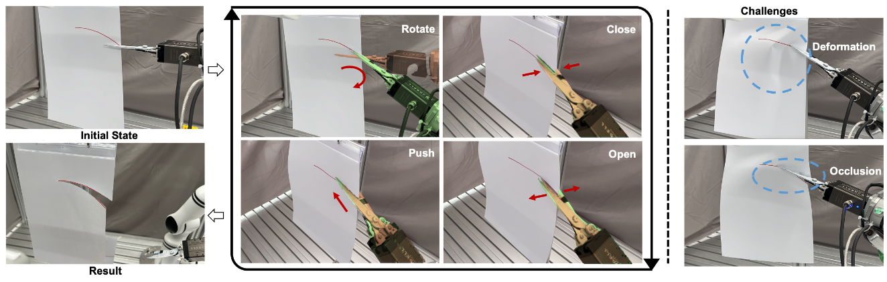
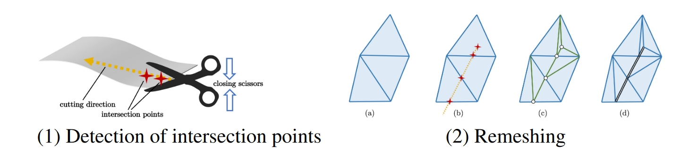

# ScissorBot: Learning Generalizable Scissor Skill for Paper Cutting via Simulation, Imitation, and Sim2Real 

CoRL 2024


### [Project Page](https://pku-epic.github.io/ScissorBot/) | [Video]() | [arXiv](https://arxiv.org/abs/2409.13966)

This repository contains code for both PaperCutting-Sim environments and training scripts for ScissorBot.

<div align="center">

</div>

## Installation

```console
conda create -n scissorbot python==3.8.16
conda activate scissorbot
python setup.py
bash setup.sh
source ~/.bashrc
```


## Simulation 
<div align="center">

</div>

### A Simple Example

```
python paper_cutting_game.py
```

### Generating expert demos
Generate demos with heuristic oracle policy:
```console
python policy/generate_demos_high_level.py \
    setup.cuda=1 demos.curve_type=two_peak  \
    demos.angle_slot=5.73 demos.max_num=1000
```

You'll get source demos through the last command. Then process demos to render them with (point cloud and action pairs)
```
python dagger/prepare_offline.py -d SRC_DATA_PATH -o OUTPUT_PATH -g $GPU -p 1 
```

## Training
### Train our imitation learning policy
```console
python dagger/bc_delta.py -b 48 \
-tp TRAIN_FOLDER_NAME -ep VAL_FOLDER_NAME \
-lvb 0.07 -s 140000 -y ./config/rl/bc_8d_no_pose.yaml \
--cuda -g $GPU \
-en EXP_NAME \
-m "{'seq_len':4}"
```


## BibTeX

If you find our work useful in your research, please consider citing:
```
@inproceedings{lyuscissorbot,
  title={ScissorBot: Learning Generalizable Scissor Skill for Paper Cutting via Simulation, Imitation, and Sim2Real},
  author={Lyu, Jiangran and Chen, Yuxing and Du, Tao and Zhu, Feng and Liu, Huiquan and Wang, Yizhou and Wang, He},
  booktitle={8th Annual Conference on Robot Learning}
}
```


## License

 This work and the dataset are licensed under [CC BY-NC 4.0][cc-by-nc].

 [![CC BY-NC 4.0][cc-by-nc-image]][cc-by-nc]

 [cc-by-nc]: https://creativecommons.org/licenses/by-nc/4.0/
 [cc-by-nc-image]: https://licensebuttons.net/l/by-nc/4.0/88x31.png

